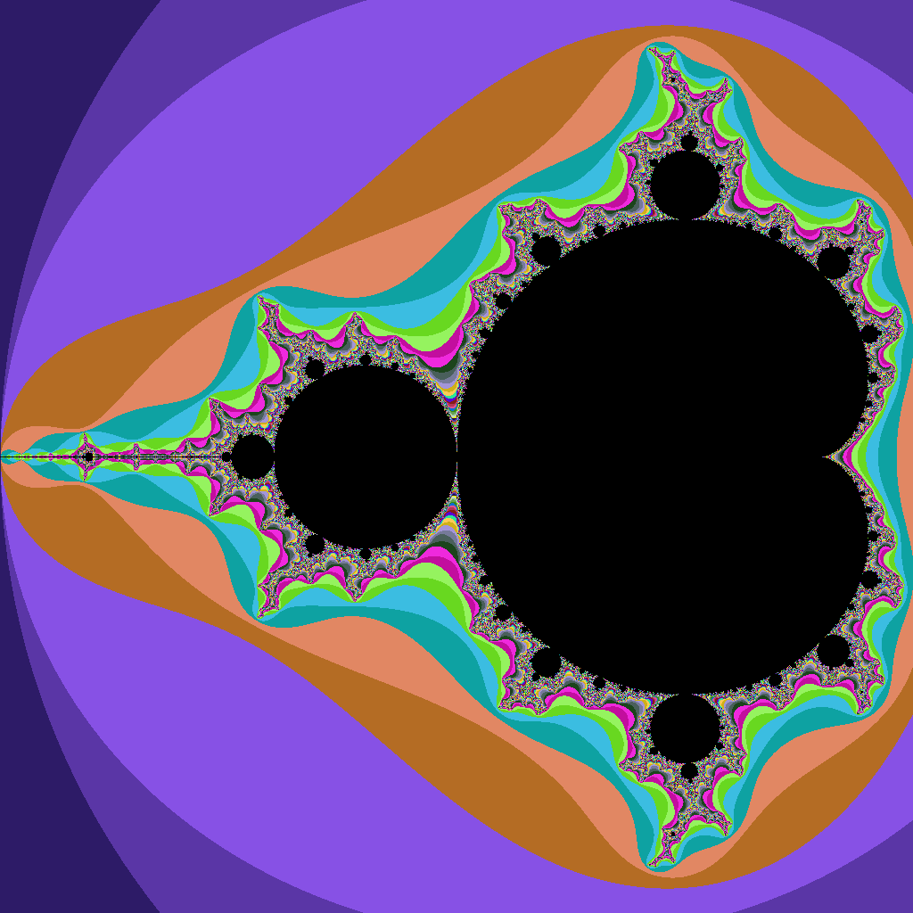

# mandelbrot

Escape-time Mandelbrot rendered by a Zig kernel: one GPU invocation per pixel writes packed RGBA8 to a storage buffer, the host reads it back and writes a binary (P6) PPM. The view rectangle (center + scale) comes in as a push constant.

```sh
zig build run-zig            # writes mandelbrot.ppm
sips -s format png mandelbrot.ppm --out mandelbrot.png   # macOS
```


